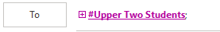

# There's probably an easier way to do this.

### But whatever.

This thing helps you randomly choose emails from a list of emails that you copy from Outlook. You need Python to run this (if you did ICS3U, you'll have it).

## Steps to generate recipient list

1.  Click on format.py in the file list above, and download it into your "Downloads" folder.

2. Go to Outlook and select all of the groups you want in your population. 

3. Expand these (by clicking the plus button beside each group), select all (Ctrl + A), and copy

4. In Downloads folder, create a new text file called text.txt and paste whatever you have on clipboard in there.

5. Open format.py in Notepad and change SAMPLESIZE variable to however many random addresses you need.  

6. Open a command line an run in "Downloads":

   ```
   python format.py
   ```

7. Open the newly create results.txt and copy all contents. 

8. Paste this into the recipients for email you want to send and click "Check Names". 

9. Your recipients are set!

## Steps to generate recipient list for only people who have taken survey.

1. Generate a recipient list (above)

2. Download "taken.py" into your Downloads folder.

3. Create a file called "taken.txt".

4. Download an Excel file of your survey results from Microsoft Forms, and open it.

5. Under the email header, select all emails, copy and paste into taken.txt

6. Run:

   ```
   python taken.py
   ```

7. Your new recipients will be in "newRecipients.txt"

## Problems?

Create an issue and I'll try to fix. 